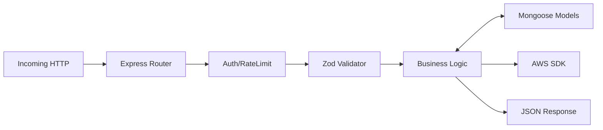
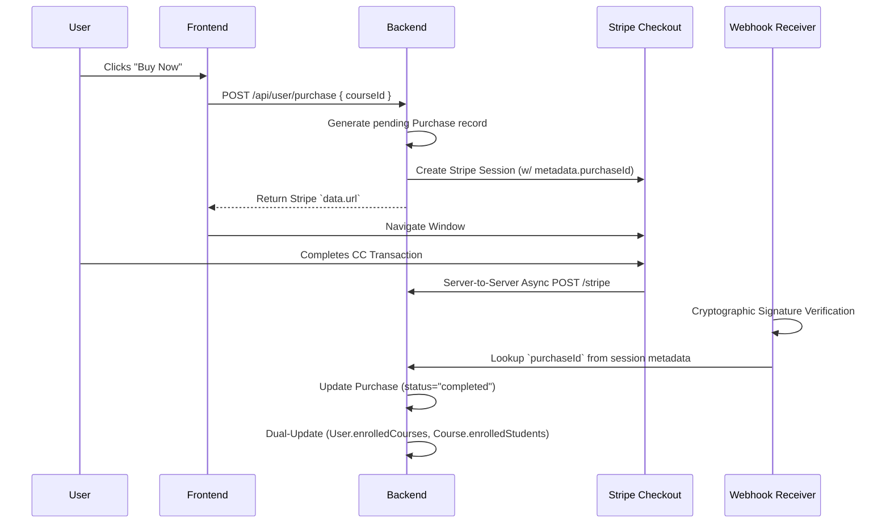

# Quantpact - Complete Project Architecture Documentation

## 📋 Table of Contents

1. [Project Overview](#project-overview)
2. [Tech Stack](#tech-stack)
3. [Directory Structure](#directory-structure)
4. [Frontend Architecture](#frontend-architecture)
5. [Backend Architecture](#backend-architecture)
6. [Database Schema](#database-schema)
7. [API Routes](#api-routes)
8. [Data Flow](#data-flow)
9. [Error Handling Strategy](#error-handling-strategy)
10. [Third-Party Integrations](#third-party-integrations)
11. [Known Technical Debt](#known-technical-debt)
12. [Environment Configuration](#environment-configuration)
13. [Deployment Details](#deployment-details)

---

## 1. Project Overview

**Quantpact** is a specialized EdTech platform for quantitative trading and high-frequency trading (HFT) built with the MERN stack. It connects domain experts (educators) with technical students, featuring:

- **Student Portal**: Browse courses, enroll, track progress, rate courses via an institutional-grade fintech UI.
- **Educator Dashboard**: Create courses, meticulously edit course content structure, view analytics, and track enrollments.
- **Secure Authentication**: Custom local JWT-based system utilizing Access and HTTP-Only Refresh tokens.
- **Payment Processing**: Stripe integration for seamless and secure checkout flow and webhook provisioning.
- **Premium Content Security**: Rate-limited AWS S3 pre-signed URLs for secure video hosting, preventing unauthorized downloads.

**Repository Structure**: `lms-main/`
- `client/` - React frontend (Vite + Tailwind CSS)
- `server/` - Node.js/Express backend (MongoDB + Mongoose)

---

## 2. Tech Stack

### Frontend

| Technology | Version | Purpose |
|------------|---------|---------|
| React | ^19.0.0 | UI framework |
| React Router DOM | ^7.1.5 | Client-side routing |
| Axios | ^1.8.1 | HTTP client |
| Tailwind CSS | ^3.4.17 | Styling |
| React Toastify | ^11.0.5 | Notifications |
| Quill | ^2.0.3 | Rich text editor |
| Vite | ^6.2.0 | Build tool |

### Backend

| Technology | Version | Purpose |
|------------|---------|---------|
| Express | ^4.21.2 | Web framework |
| Mongoose | ^8.10.2 | MongoDB ODM |
| JSONWebToken (JWT) | ^9.0.2 | Authentication |
| BcryptJS | ^2.4.3 | Password Hashing |
| Stripe | ^17.7.0 | Payment processing via webhooks |
| AWS SDK (S3) | ^3.x | Media storage & secured streaming |
| Zod | ^3.x | Request payload schema validation |
| CORS & Rate Limit | ^2.x, ^7.x | Security & abuse mitigation |

---

## 3. Directory Structure

```
lms-main/
├── client/                          
│   ├── src/
│   │   ├── components/              # Reusable UI components (Student & Educator divisions)
│   │   ├── context/                 # Global state management (`AppContext.jsx`)
│   │   ├── pages/                   # Route-level components (`Player.jsx`, `EditCourse.jsx`)
│   │   └── App.jsx                  # Main app component & Routing tree
│
└── server/                          
    ├── configs/                     
    │   ├── mongodb.js              # Mongoose DB connection logic
    │   ├── s3.js                   # AWS SDK configuration & presigned URL generators
    │   └── multer.js               # Multer memory storage configuration
    ├── controllers/                 # Core business logic (isolated from rote HTTP handling)
    ├── middlewares/                 # JWT (`protect`), Role checking (`educatorOnly`), Rate limiting
    ├── models/                      # User, Course, Purchase, CourseProgress Mongoose Schemas
    ├── routes/                      # Route maps mapping endpoints to controllers
    ├── validators/                  # Zod validation schemas (e.g., `courseValidator.js`)
    └── server.js                    # Application entry point & webhook mounting
```

---

## 4. Frontend Architecture

### Core State Management (AppContext)
Global app state and centralized API calls are managed via the React Context API (`client/src/context/AppContext.jsx`).

- **Auth State**: Manages `token`, `userData`, and active role (`isEducator` dynamically resolved from JWT payload/User lookup).
- **Core Global Caching**: Preserves `allCourses` and `enrolledCourses` arrays in memory to prevent redundant heavy API requests.

### Protected Player Mechanism
- **Content Delivery**: The `Player.jsx` determines dynamically if a video is YouTube or S3.
- **S3 Authorization**: If it's a secured video, the player posts to `/api/user/get-video-url`. The backend responds with a short-lived presigned URL, and the HTML5 `<video>` element enforces strict UX constraints (disabled right click, download disabled attribute).

---

## 5. Backend Architecture

### Design Pattern
The backend is structured using a rigorous separation-of-concerns MVC approach.



### Rate Limiting & Abuse Prevention
We protect sensitive compute/bandwidth routes against scraping or DDOS.
- **Implementation**: `videoUrlRateLimiter` applies to `POST /api/user/get-video-url`.
- **Strategy**: Bounded at **30 requests per minute**.
- **Key Dimension**: Throttled by the strictly authenticated User ID (`req.user._id`), intentionally bypassing IP/IPv6 grouping rules. This resolves NAT gateway issues while effectively crippling automated scrapers attempting distributed botnet scraping behind authenticated accounts.

---

## 6. Database Schema

Mongoose strictly enforces relational connections via nested ObjectId population.

### 1. User Model (`User.js`)
Handles auth identity, roles, and quick-lookup of student's purchased content.
```javascript
{
  name: { type: String, required: true },
  email: { type: String, required: true, unique: true },
  password: { type: String, required: true }, // Bcrypt hashed
  imageUrl: { type: String }, 
  role: { type: String, enum: ["student", "educator", "admin"], default: "student" },
  refreshToken: { type: String }, // Used for long-lived session continuity
  resetPasswordToken: { type: String },
  resetPasswordExpiry: { type: Date },
  enrolledCourses: [{ type: mongoose.Schema.Types.ObjectId, ref: "Course" }],
  timestamps: true
}
```

### 2. Course Model (`Course.js`)
Stores hierarchical curriculum data (Chapters -> Lectures) and caching arrays.
```javascript
{
  courseTitle: String,
  courseDescription: String,
  courseThumbnail: String,  // S3 or public URL
  coursePrice: Number,
  isPublished: Boolean,
  discount: Number,
  courseContent: [{
    chapterId: String,
    chapterOrder: Number,
    chapterTitle: String,
    chapterContent: [{
      lectureId: String,
      lectureTitle: String,
      lectureDuration: Number,
      lectureUrl: String,   // Usually an S3 object key or YT ID
      isPreviewFree: Boolean,
      lectureOrder: Number
    }]
  }],
  courseRatings: [{ userId: String, rating: Number }],
  educator: { type: mongoose.Schema.Types.ObjectId },
  enrolledStudents: [{ type: mongoose.Schema.Types.ObjectId }], 
  timestamps: true
}
```

### 3. Purchase Model (`Purchase.js`)
Auditable ledger for financial transactions resolving via Stripe.
```javascript
{
  courseId: { type: mongoose.Schema.Types.ObjectId, ref: "Course", required: true },
  userId: { type: mongoose.Schema.Types.ObjectId, ref: "User", required: true },
  amount: { type: Number, required: true }, // Captured value in integer cents
  status: { type: String, enum: ["pending", "completed", "failed"], default: "pending" },
  timestamps: true
}
```

### 4. CourseProgress Model (`CourseProgress.js`)
Decoupled schema specifically for progress computation avoiding `Course` schema bloat.
```javascript
{
  userId: { type: mongoose.Schema.Types.ObjectId, ref: "User", required: true },
  courseId: { type: mongoose.Schema.Types.ObjectId, ref: "Course", required: true },
  completed: { type: Boolean, default: false }, // Has finished entire curriculum
  lectureCompleted: [], // Array of string identifiers (lectureId)
}
```

---

## 7. API Routes

Base Prefix: `/api`

### Auth Routes (`/auth/*`)
| Method | Path | Middleware | Purpose |
|---|---|---|---|
| POST | `/register` | *None* | Zod-validated user registration. Returns JWT + Set-Cookie. |
| POST | `/login` | *None* | Credential verification. Returns Access JWT + Set-Cookie Refresh JWT. |
| GET | `/refresh` | *None* | Re-issues a short-lived access token by verifying the HTTP-Only cookie. |
| POST | `/logout` | *None* | Nullifies Refresh JWT in DB and clears the browser cookie. |
| GET | `/me` | `protect` | Validates active token and returns the caller's sanitized `User` profile. |

### Course Routes - Public (`/course/*`)
| Method | Path | Middleware | Purpose |
|---|---|---|---|
| GET | `/all` | *None* | Fetch all `isPublished=true` courses. Includes stripped lecture tree. |
| GET | `/:id` | *None* | Fetch deep, unauthenticated preview details for a single course landing page. |

### User Tracking & Commerce (`/user/*`) Note: All routes use `protect`
| Method | Path | Middleware | Purpose |
|---|---|---|---|
| GET | `/data` | `protect` | Alternative endpoint retrieving user data. |
| GET | `/enrolled-courses` | `protect` | Populates the `enrolledCourses` array resolving to full `Course` objects. |
| POST | `/purchase` | `protect` | Scaffolds a new `Purchase` intent, returning a Stripe Checkout Session URL. |
| POST | `/update-course-progress` | `protect` | Appends a `lectureId` to the `CourseProgress` model array. |
| POST | `/get-course-progress` | `protect` | Retrieves the User's array of completed lectures for a specific `courseId`. |
| POST | `/get-video-url` | `protect` + `videoUrlRateLimiter` | Generates a 4-hour S3 Presigned `GET` URL for authorized streaming. |
| POST | `/add-rating` | `protect` | Appends User rating to `Course.courseRatings` array. |

### Educator Administration (`/educator/*`) Note: Most routes use `protect`, `educatorOnly`
| Method | Path | Middleware | Purpose |
|---|---|---|---|
| GET | `/update-role` | `protect` | Self-serve role escalation from Student to Educator status. |
| POST | `/add-course` | `protect`, `educatorOnly`, `multer` | Parses form-data, securely uploads thumbnails to S3, constructs the `Course`. |
| GET | `/courses` | `protect`, `educatorOnly` | Fetches courses explicitly owned by `req.user._id`. |
| GET | `/course/:courseId` | `protect`, `educatorOnly` | Fetches edit-focused granular config (pre-populate React form). |
| PUT | `/update-course/:courseId` | `protect`, `educatorOnly` | Heavy structural overwrite payload utilizing strict `courseValidator.js` Zod checks. |
| GET | `/dashboard` | `protect`, `educatorOnly` | Computes aggregate financial revenue, enrollments, and ratings for chart telemetry. |

### Webhooks (`/*`)
| Method | Path | Middleware | Purpose |
|---|---|---|---|
| POST | `/stripe` | *Express RAW parser* | Confirms Stripe Event signature, transitions `Purchase` to completed, provisions the course. |

---

## 8. Data Flow

### Authentication & Token Rotation Policy
We have implemented **OAuth2-style Silent Token Refresh Strategy** to maintain highly secure sessions without persistent UX interruptions.
1. `Access Token` lifetime: 15 Minutes. Used in `Authorization: Bearer <token>`.
2. `Refresh Token` lifetime: 7 Days. Strictly an **HTTP-Only, Secure, SameSite=Strict** cookie.
3. **Rotation**: When the React Axios client intercepts a `401 Unauthorized`, it invokes `GET /api/auth/refresh`. The server independently burns the used Refresh Token, re-issues a new Refresh Token into the cookie layer, generates a new Access Token payload, thus completing the security rotation without user prompt.

### Stripe Webhook Provisioning Architecture
Handling out-of-band asynchronous transaction confirmations is critical to prevent fraud.



---

## 9. Error Handling Strategy

Quantpact employs a highly standardized global constraint loop.

**1. Response Format:** Every single intercepted or thrown error conforms to an explicit JSON envelope structure:
```json
{
  "success": false,
  "message": "Human readable technical reason"
}
```

**2. Standard Try/Catch Trap:**
All controller methods are strictly blanketed in async closures:
```javascript
export const anyController = async (req, res) => {
  try {
    // Controller specific logic ...
    res.json({ success: true, data });
  } catch (error) {
    console.error(error); // Server log
    res.status(500).json({ success: false, message: error.message }); // Client envelope
  }
}
```

**3. Zod Payload Validation Failure:**
Validation logic halts execution gracefully at the controller ingress point.
```javascript
const { success, data, error } = schema.safeParse(req.body);
if (!success) {
  return res.status(400).json({ success: false, message: error.issues[0].message });
}
```

---

## 10. Third-Party Integrations

### AWS S3 Conventions & Presigned Operations
Cloudinary was aggressively deprecated in favor of scalable AWS SDK logic.

- **Bucket Hierarchy Constraint Guidelines**:
We attempt to partition keys safely to avoid bucket traversal entropy:
```text
/courses/<course_id>/thumbnail_<timestamp>.jpg  // Public structural images
/courses/<course_id>/lectures/<uuid>.mp4        // Secured video payloads
```
- **The Presigned Magic**: S3 buckets remain `Block All Public Access`. Videos are legally accessed via URL params embedding scoped IAM signatures computed on the fly by `generatePresignedGetUrl()`.

---

## 11. Known Technical Debt

As developers heavily iterating on architecture, the following items are acknowledged bottlenecks that **must** be addressed before scaling past 100,000 monthly active users:

1. **Dual Enrollment Tracking Splintering**:
   - Currently, a purchase blindly manipulates `User.enrolledCourses.push(...)` AND `Course.enrolledStudents.push(...)`.
   - *Risk*: A mid-transaction server fault could successfully push to the user array, but crash before updating the course array, destroying relational integrity.
   - *Future Fix*: Shift entirely to the `Purchase` collection as the single source of truth and compute arrays downstream using MongoDB aggregation pipelines.

2. **Unbounded 16MB Document Sizing Warning**:
   - The `Course.enrolledStudents` array grows boundlessly. A highly viral course gaining >500k students will result in the `Course` document breaching the hard physical 16MB MongoDB BSON size cap.
   - *Future Fix*: Immediately deprecate embedding large arrays in parent definitions. Query relationships via index constraints instead.

3. **Index Deficiencies**:
   - The system is doing frequent collection scans searching for courses (`GET /course/all`). `isPublished` Boolean attributes currently lack B-Tree index specifications, resulting in linearly degrading O(N) read latency.

---

## 12. Environment Configuration

### Client (`client/.env`)
```env
VITE_BACKEND_URL=http://localhost:5000
VITE_CURRENCY=$
```

### Server (`server/.env`)
```env
PORT=5000
MONGODB_URI=mongodb+srv://<auth_user>:<auth_pass>@cluster.mongodb.net/quantpact
JWT_SECRET=super_secret_access_string (Must be strong 256bit entropy)
JWT_EXPIRY=15m
REFRESH_TOKEN_SECRET=super_secret_refresh_sequence
AWS_REGION=us-east-1
AWS_ACCESS_KEY_ID=XXX_IAM_POLICY_KEYS_XXX
AWS_SECRET_ACCESS_KEY=XXX_IAM_POLICY_KEYS_XXX
S3_BUCKET_NAME=quantpact-assets
STRIPE_SECRET_KEY=sk_test_... // Skips CC decline checks
STRIPE_WEBHOOK_SECRET=whsec_... // Used for Express signature validations
```

---

## 13. Deployment Details

### Infrastructure Orchestration
The app is designed to run statelessly across any node.js hosting provider natively, currently optimized for **Vercel Serverless Function** executions.

### Vercel Serverless Configurations & Challenges
**File:** `server/vercel.json`
```json
{
  "version": 2,
  "builds": [{ "src": "server.js", "use": "@vercel/node" }],
  "routes": [{ "src": "/(.*)", "dest": "server.js" }]
}
```

*Architectural Warnings:*
1. **Cold Starts**: MongoDB Atlas connection pools (`configs/mongodb.js`) will incur ~1-3s connection latency overhead when a Vercel function goes idle and wakes. First login delays are expected on the Free or Hobby Vercel tiers.
2. **Bandwidth Limitations**: Multer parses `multipart/form-data` into RAM inside memory buffers before transferring to S3. Vercel enforces a 4.5MB payload constraint on standard API endpoints. Any video uploaded directly exceeding 4.5MB via standard `POST` *will* crash via 413 Payload Too Large HTTP faults. 
*(For large video files >5MB, the platform must transition exclusively to S3 Direct multipart Presigned PUT logic on the client-side rather than passing buffers through the backend layer.)*
